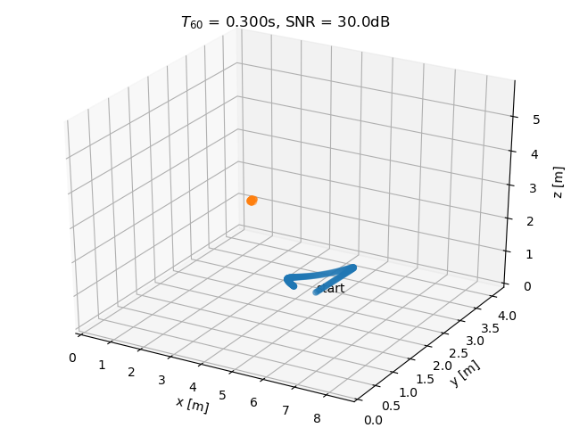
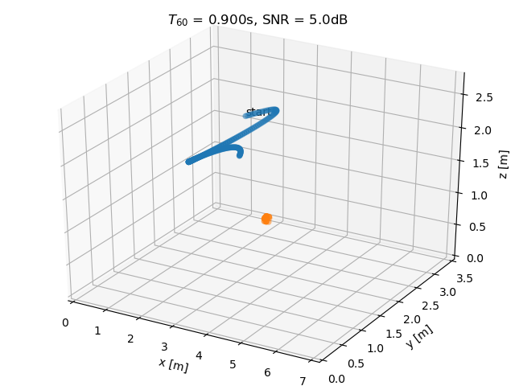
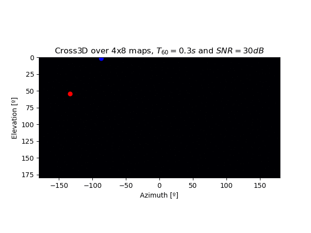
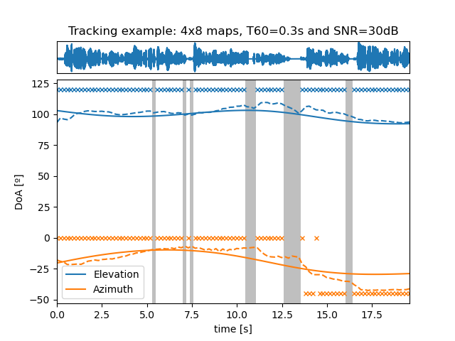
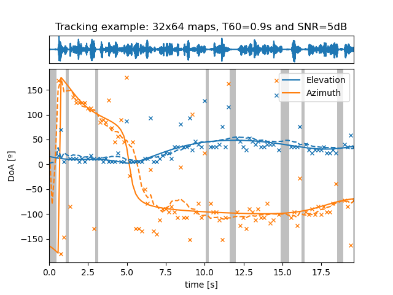

# Robust Sound Source Tracking Using SRP-PHAT and 3D Convolutional Neural Networks

Code repository for the paper _Robust Sound Source Tracking Using SRP-PHAT and 3D Convolutional Neural Networks_
[[1]](#references).

- [Dependencies](#dependencies)
- [Datasets](#datasets)
- [Main scripts](#main-scripts)
- [Other source files](#other-source-files)
- [Pretrained models](#pretrained-models)
- [References](#references)

   
   

   
   

   
   

## Dependencies

* Python: it has been tested with Python 3.8
* Numpy, matplotlib, scipy, soundfile, pandas and tqdm
* Pytorch: it has been tested with Python 1.4.0
* [webrtcvad](https://github.com/wiseman/py-webrtcvad)
* [gpuRIR](https://github.com/DavidDiazGuerra/gpuRIR) [[2]](#references)

## Datasets

* **LibriSpeech** The training dataset is generated during the training of the models as the trajectories are needed, 
but to simulate them you will need to have the [LibriSpeech corpus](http://www.openslr.org/12) in your machine. By 
default, the main scripts look for it in [datasets/LibriSpeech](https://github.com/DavidDiazGuerra/Cross3D/tree/master/datasets/LibriSpeech) 
but you can modify its phat with the `path_train` and `path_test` variables.
* **LOCATA** In order to test the models with actual recordings, you will also need the dataset of the 
[LOCATA challenge](https://www.locata.lms.tf.fau.de/). By default, the main scripts look for it in 
[datasets/LOCATA](https://github.com/DavidDiazGuerra/Cross3D/tree/master/datasets/LOCATA) 
but you can modify its phat with the `path_locata` variable.

## Main scripts

There is a main script for each model analyzed in the paper. The scripts train the model, save the trained model, test
it for several reverberation times and SNRs, save the results, plot them, and finally test the model with the recordings
of the LOCATA challenge. 

* **[1sourceTracking_Cross3D.py](https://github.com/DavidDiazGuerra/Cross3D/blob/master/1sourceTracking_Cross3D.py)**
Cross3D is the main contribution of the paper, performing causal DOA estimation and tracking of one acoustic source 
using a 3D CNN over sequences of SRP-PHAT power maps. You can modify the resolution of the power maps with the 
`res_the` and `res_phi` variables.
* **[1sourceTracking_fromGCCs.py](https://github.com/DavidDiazGuerra/Cross3D/blob/master/1sourceTracking_fromGCCs.py)**
This model uses a causal 1D CNN over GCCs sequences. Although using GCCs as inputs of a Neural Network for DOA estimation
is a quite common technique, using 1D CNNs over them to also perform the tracking of the source is an approach, to the 
best of the authors' knowledge, unpublished.
* **[1sourceTracking_fromMaximums.py](https://github.com/DavidDiazGuerra/Cross3D/blob/master/1sourceTracking_fromMaximums.py)**
This model uses a causal 1D CNN over the coordinates of the maximums of high resolution SRP-PHAT maps.
* **[1sourceTracking_fromSpectrograms.py](https://github.com/DavidDiazGuerra/Cross3D/blob/master/1sourceTracking_fromSpectrograms.py)**
This model uses a causal 2D CNN over the spectrograms of the signals of each microphone.
* **[1sourceTracking_SELDnet.py](https://github.com/DavidDiazGuerra/Cross3D/blob/master/1sourceTracking_fromSpectrograms.py)**
This model is a modification of the proposed in [[3]](#references), we removed the Sound Event Detection (SED) output and keep only one
localization output since we were interested only in the tracking of one source. It uses a combination of 2D convolutional 
layers and non-causal recurrent layers over the spectrograms of the signals of each microphone. You can find the whole 
model in [its repository](https://github.com/sharathadavanne/seld-net).

The RAM consumption keeps increasing during the training, but it should still be possible to train the models in most of
the machines, although it may crash when it try to test them (after saving the trained model). Please, let me know if you
find where the memory leak is. 

The training of the models took about 25 hours in a Nvidia GeForce GTX 980Ti with an Intel Core i7-6700 CPU and 16GB of
RAM. The test in the simulated scenarios took about 1 hour.

## Pretrained models

You can find the pretrained models in the [release section](https://github.com/DavidDiazGuerra/Cross3D/releases) of the 
repository.

## Other source files

`acousticTrackingDataset.py`, `acousticTrackingLearners.py`, `acousticTrackingModels.py` and `acousticTrackingDataset.py`
contain several classes and functions employed by the main scripts. They have been published to facilitate the 
replicability of the research presented in [[1]](#references), not as a software library. Therefore, any feature included 
in them that is not used by the main scripts may be untested and could contain bugs.

## References

>[1] D. Diaz-Guerra, A. Miguel and J. R. Beltran, "Robust Sound Source Tracking Using SRP-PHAT and 3D Convolutional Neural Networks," in IEEE/ACM Transactions on Audio, Speech, and Language Processing, vol. 29, pp. 300-311, 2021 [[DOI](https://doi.org/10.1109/TASLP.2020.3040031)] [[arXiv preprint](https://arxiv.org/abs/2006.09006)].
>
>[2] D. Diaz-Guerra, A. Miguel, J.R. Beltran, "gpuRIR: A python library for Room Impulse Response simulation with GPU 
acceleration," in Multimedia Tools and Applications, Oct. 2020 [[DOI](https://doi.org/10.1007/s11042-020-09905-3)] [[SharedIt](https://rdcu.be/b8gzW)] [[arXiv preprint](https://arxiv.org/abs/1810.11359)].
>
>[3] Sharath Adavanne, Archontis Politis, Joonas Nikunen, and Tuomas Virtanen, "Sound event localization and detection 
of overlapping sources using convolutional recurrent neural network" in IEEE Journal of Selected Topics in Signal 
Processing (JSTSP 2018).
